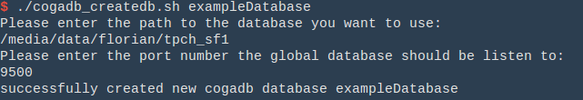
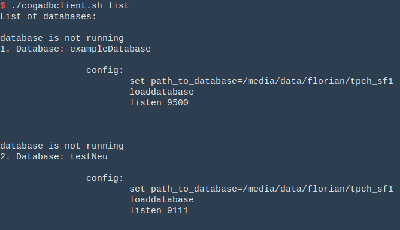
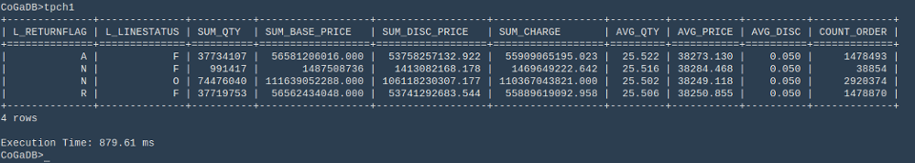

User Guide
==========

CoGaDB: A Column-oriented GPU-accelerated DBMS User Guide

## Prequisites
- Operating System: Ubuntu Version 12.04.3 LTS or higher (64 bit)
- Compiler: g++ version 4.6 or higher

Tools

- NVIDIA CUDA Toolkit 6.5 or higher
- cmake version 2.6 or higher
- make
- Doxygen (Documentation Generation)
- Pdf Latex (Documentation Generation)
- Bison (supported from version 2.5)
- Flex
- Mercurial (version control system)
- clang and LLVM (optional, if you want to use the query compiler)

Libraries:

- Boost Libraries version 1.48 or higher
- Readline Library
- Intel TBB Library
- BAM Library (optional, required for Genomics Extension)
- XSLT Library (Documentation Generation)
- Google Sparse Hash

Hardware

- Intel CPU (optional, required for using Intel PCM Library)
- NVIDIA GPU (optional, required for GPU acceleration)


## Source Code
After you got access to the repositories, you can checkout the source code with mercurial using the following bash code.

```bash
hg clone <your URL to gpudbms on Bitbucket>
hg clone https://YOURUSERNAME@bitbucket.org/bress/gpudbms
```
Note the structure of the repository. CoGaDB consists of three repositories:

1. The HyPE Library: The learning-based physical Optimizer
2. CoGaDB: The actual DBMS
3. GPUDBMS: A repository that combines the build systems of CoGaDB and HyPE, and also contains external libraries (e.g., Thrust or Intel PCM Libraries).

The reason of this separation is that the physical optimizer is organized as a library, and users of HyPE typically have their own database engine, and hence, do not want to checkout CoGaDB together with HyPE.
After checkout, you need to switch to the development branches in CoGaDB and HyPE. Here are the commands:

```bash
cd cogadb
hg pull && hg update stable
cd ..
cd hype-library
hg pull && hg update stable
cd ..
```

Installation Steps

First you need to install all libraries specified in the perquisites section. In case you run an up-to-date Ubuntu, you can use the following commandline:
```bash
sudo apt-get install gcc g++ make cmake flex bison libtbb-dev \
libreadline6 libreadline6-dev doxygen doxygen-gui graphviz \
texlive-bibtex-extra texlive-fonts-extra \
texlive-fonts-extra-doc ghostscript texlive-fonts-recommended \
xsltproc libxslt1-dev nvidia-cuda-toolkit sharutils\
libsparsehash-dev libbam-dev samtools clang
```

If you want to setup a system without documentation support, you can use the following commandline:

```bash
sudo apt-get install gcc g++ make cmake flex bison libtbb-dev \
libreadline6 libreadline6-dev nvidia-cuda-toolkit \
libsparsehash-dev libbam-dev samtools clang
```

If you can also sacrifice GPU support, you do not have to install the CUDA library (ONLY works for BRANCHES development, cpp_query_compilation, genomics_default FOR NOW):

```bash
sudo apt-get install gcc g++ make cmake flex bison libtbb-dev \
libreadline6 libreadline6-dev libsparsehash-dev libbam-dev \
samtools clang
```

Now only boost is missing. To install boost, you can use the following command line:

```bash
sudo apt-get install libboost-filesystem-dev libboost-system-dev \
libboost-thread-dev libboost-program-options-dev \
libboost-serialization-dev libboost-chrono-dev \
libboost-date-time-dev libboost-random-dev libboost-iostreams-dev
```

Now we are able to compile CoGaDB. Enter the main directory gpudbms in a terminal. We now have to generate a build system using cmake. It is considered good practice to separate the source tree from the separated build system. Therefore, we will generate the build system into a sub directory.
Development is often easier if we have compiled the source code with debugging symbols and without optimization. On the other hand, we need to compile source with optimizations and without debugging symbols to achieve maximal performance. Therefore, we will generate two build systems. One builds CoGaDB in debugging mode, whereas the other builds CoGaDB in release mode. You can enter the following commands to achieve this:
```bash
mkdir debug_build
cd debug_build
cmake -DCMAKE_BUILD_TYPE=Debug ..
make
cd ..
mkdir release_build
cd release_build
cmake -DCMAKE_BUILD_TYPE=Release ..
make
cd ..
```
Now, debug_build contains the build system in debug mode, whereas the build system in release_build compiles CoGaDB in release mode. Just enter a directory, hit make, and launch using ./cogadb/bin/cogadbd. Since CoGaDB consists of many source files, you can speedup the build process by instructing make to compile multiple source files in parallel. You can do this by using the -j option of make, where you specify the number of parallel build processes, which is typically your number of CPU cores.
That's it, you can now start developing CoGaDB!

## Configuration of the Cmake Build System Generator
You can influence the behavior of cmake by adjusting the Variables in the CMakeCache.txt. You can also set a variable using the commandline interface. Let us assume we want to change the build type of our build system from Debug to Release. The build type is stored in the variable CMAKE_BUILD_TYPE. Now, we can change the build type using the following command:
```bash
cmake -DCMAKE_BUILD_TYPE=Release ..
```
There are many variables that allow customization. We list here the most important ones:
```bash
ENABLE_SIMD_ACCELERATION
ENABLE_BRANCHING_SCAN
CMAKE_VERBOSE_MAKEFILE
CMAKE_CXX_FLAGS_RELEASE
CMAKE_CXX_FLAGS_DEBUG
```
## Basics on Repository Management and Mercurial
The source code is managed by the decentralized version control system mercurial and is organized in branches. We have one branch for the current stable version of CoGaDB and HyPE. Both branches are named default. Then, there is one separate development branch in HyPE and CoGaDB. In CoGaDB, it is named parallel_gpu_kernels. In HyPE, it is named hybrid_query_optimization. By convention, it is forbidden to directly implement new features in stable and development branches. To start implementing new features, we need to checkout the newest version of the development branch, and create your own branch using the following commands:
```bash
hg update development
hg branch <branch name>
```
As a general rule, you should regularly merge changes from the development branch (Note: Typically, you will receive an Email, which explains new features and requests you to merge these changes in your branch.) You can do so using the following commandline:
hg merge development
Then, you need to resolve possible conflicts. Afterwards, you need to commit your merge step, and push it into the repository. You can do that using the following commands:
```bash
hg commit -m “merged changes from development branch into \
branch <YOUR BRANCH NAME>”
hg push
```
When you start working with mercurial, multiple people may change something in the same or different branch.  
Thus, you should regularly pull those changes to stay up to date:
```bash
hg pull
```
However, we now only pulled the changes from the server, but we have yet to apply them to our source code:
```bash
hg update
```
In case the update fails, it means someone else made changes in your branch. Therefore, you have to merge those changes:
```bash
hg merge
```
In case they are conflicts, resolve them using your favorite merging tool. After a merging operation, you always need to commit your changes:
```bash
hg commit
```
If you want to upload your changes to the repository, you need to perform a push operation.
```bash
hg push
```

## Implementing New Features
When we implement new features, we often create new source files, which we need to add to the build system and the source tree.
Let us assume you add a file foo.cpp to CoGaDB's util directory `cogadb/src/util/foo.cpp`

Then, we need to tell mercurial it should keep track of the changes to these file by adding it to the source tree:
```bash
hg add cogadb/src/util/foo.cpp
```
Now, we have to tell cmake, that there is a new source file to compile. For this, we need to edit CoGaDB's CMakelists.txt file and add the source file to the list of source files for CoGaDB. This list starts with cuda_add_library and has the name cogadb.
Now type make, and your source file is compiled and linked into CoGaDB. Note that you only need to add a file to the build system, if it is a translation unit, such as C (.c), C++ (.cpp), or CUDA (.cu) source files. You do NOT need to add header files  (.h or .hpp) to the build system!


## Bug Reports and Feature Requests
To keep track of found bugs and feature requests, we use the build-in issue tracking of Bitbucket:
[CoGaDB issues on bitbucket](https://bitbucket.org/bress/cogadb/issues)

When reporting a bug, it is important to provide the following information to ensure a timely reponse:

1. A short description of the error, including the expected behavior, and the observed behavior.

2. Compile CoGaDB in debug mode and provide a stack trace. You can provide a stacktrace using your favorite IDE or the commandline-based gdb:
`gdb ./cogadbd`
Then type `bt`, to get a backtrace.

3. Provide the commands and queries you gave CoGaDB. Typically, a user loads a database using the build-in scripting language of CoGaDB. The default script is startup.coga, which is executed on startup.

As for feature requests, they should be short and self-contained. Note that feature requests are implemented on a best-effort basis.

## Setting up a Database and Issue Queries

At first, we have to create a directory, where CoGaDB can store its database:
```bash
set path_to_database=/home/DATA/coga_databases/ssb_sf1
```
Then, we have to create a database and import data. This can be done in two ways: using the sql interface (create table, insert into), or using a utility command. CoGaDB supports utility commands for importing databases from two common OLAP benchmarks: the TPC-H and the Star Schema Benchmark. Note that you have to generate the _.tbl files_ using the dbgen tool. Assuming we have generated a database for the star schema benchmark of scale factor one and stored the resulting _.tbl files_ in `/home/DATA/benchmarks/star_schema_benchmark/SF1/`, we can import the data with the following command:

```bash
create_ssb_database /home/DATA/benchmarks/star_schema_benchmark/SF1/
```

For the TPC-H benchmark, the command is `create_tpch_database`.

Now CoGaDB imports the data and stores them in the database. Depending on the scale factor, this can take a while. After the import finishes, we can start working with the database. Since CoGaDB is an in-memory database, we first have to load the database in the main memory:

```bash
loaddatabase
```
Then, we can start issuing queries. We can either use SQL or build-in aliases for stored queries. We provide stored queries for all queries of the star schema benchmark. The template command is _ssbXY_, which executes SSB-Query X.Y (X has to be a number between 1 and 4; Y has to be a number between 1 and 3 except when X is 3, in this case 4 is valid for Y as well).
Now, we can launch queries:

```sql
CoGaDB>select sum(lo_extendedprice * lo_discount) as revenue \
from lineorder, dates \
where lo_orderdate = d_datekey and \
d_weeknuminyear = 6 and d_year = 1994 \
and lo_discount between 5 and 7 and \
lo_quantity between 26 and 35;
+-------------+
| REVENUE	  |
+=============+
| 2.49945e+10 |
+-------------+
1 rows
Execution Time: 155.28039 ms
```

You can get a complete list of supported script commands by typing help. You can issue any number of commands in the startup script startup.coga, to automatically load a database and set certain parameters.

## Support ##
In case you have any questions or suggestions, please do not hesitate to contact the development team via the mailing list _(cogadb@googlegroups.com)_ or Sebastian Breß _(sebastian.bress@dfki.de)._


# How To use the CoGaDB clientscript

_This document briefly describes the CoGaDB clientscript. It will give an overview over its functions and how to use them._

## What is the CoGaDB clientscript?

The _CoGaDB clientscript_ is a userfriendly wrapper for using the
**C**olumn-**o**riented **G**PU-**a**ccelerated **DB** (CoGaDB). It helps you to create different databases of CoGaDB and keeps track of them. With some simple commands you are able to start/stop your databases and connect to them. Furthermore the _clientscript_ can get you an overview of all databases you have created so far, so you don't loose track.

## Where can I find the CoGaDB clientscript?

The _CoGaDB clientscript_ is located under

    $COGADB_BITBUCKET_DIR/client/cogadbclient.sh

As well as the two other scripts for _creating_ and _deleting_ a _CoGaDB_ database, we will handle in a few chapters laters.

## How to use the CoGaDB clientscript

In the following you will get familiar with the usage of the _CoGaDB clientscript_ and its functions.

### Basic usage

The _CoGaDB clientscript_ is a bash script, so it can be used in any bash-supporting shell. The clientscript allows you to start _CoGaDB_ in three different ways:

1. Start CoGaDB with a local config file named **startup.coga**:

    If you call the CoGaDB script with no option (the options will be handled later) the _clientscripts_ looks in the current directory you called the script from for a CoGaDB-config file. If the file does exist a new instance of CoGaDB will be started using this config file.

2. Start CoGaDB with a global config file

    If the _clientscript_ does not find a local config file, as described in point 1. the script looks for a global config file named **startup.coga** in the directory ".cogadb" which must be located in your home directory. In order to start CoGaDB with a global config file you just have to place it under "$HOME/.cogadb/" and start the _clientscript_ without a parameter.

3. Start CoGaDB with one of your created databases

    This is the main purpose of the _clientscript_. For this you just have to call the _clientscript_ and pass the _database option_ **"-D"** with the name of the database you want to start. For example if you want to start a database named "easyToStart", you type the following command in your shell:


    ```shell
    cogadbclient.sh -D easyToStart
    ```

    After a successfull connection to the database the script will leave you with the known prompt of CoGaDB.


### List all available databases

The _CoGaDB clientscript_ allows you to get an overview over all CoGaDB-databases you have create so far. Just type the following command into your shell

    cogadbclient.sh list

and you get a list of all databases with information about their config files and their currently status.

### Starting and stopping database instances

Using the _-D_ option from the _CoGaDB clientscript_ allows you to connect to running instances of databases. If you try to connect to a currently inactive databases you will receive an error. But starting and stopping a _CoGaDB_ database is as simple as connecting to one. You just have to use the following commands:

In order to **start** a CoGaDB database type:

```shell
    cogadbclient.sh start $Name_of_the_database
```

In order to **stop** a running CoGaDB database just type:

```shell
    cogadbclient.sh stop $Name_of_the_database
```

### Creation and deletion of CoGaDB databases

Besides the _CoGaDB clientscript_ acting as a comfortable client to _CoGaDB_, there also exits two more scripts. These scripts each have only one purpose and will help you to **create** and **delete** a new respectively an existing database for _CoGaDB_. In the following we will show you how to use them.

#### Create a new CoGaDB database

For creating a new _CoGaDB_ database you have to use the script named ```cogadb_createdb.sh``` in the following way. To create a database with an arbitary name you just call:

```shell
cogadb_createdb.sh $NAME_OF_YOUR_NEW_DATABASE
```

At first you will be prompted to enter the location of the database you want to use in _CoGaDB_, like a **TPC-H** or **SSB** database. After that you will be asked for a port number the new _CoGaDB_ database should be listen to while running.

This finishes the creation. You have successfully created your new _CoGaDB_ database.

#### Delete a CoGaDB database

In order to delete an existing _CoGaDB_ database you just have to use the script ```cogadb_deletedb.sh``` and pass the name of the database you wish to delete. So for example if you want to delete a database with the name **TestDatabase**, just have to call the script like this:

```shell
cogadb_createdb.sh TestDatabase
```

The database with the name **TestDatabase** will then be deleted.


## An example

In this little example we will show you how to use the _clientscript_ for _CoGaDB_. Together we will create the example database **exampleDatabase** in _CoGaDB_ which will be a **TPC-H**-database and execute two simple queries. After that we will stop and delete this database and end this example.

### Create a new CoGaDB database
At first we will create the database. The name will be **exampleDatabase**. Therefore we need to call the script _cogadb\_createdb.sh_ like this


```shell
cogadb_createdb.sh exampleDatabase
```

Now we will be asked for the location of the database we want to use. In the beginning we stated, that we want to use a **TPC-H**-database. Hence we enter the location of our **TPC-H**-database with a scale-factor of 1 and hit 'Enter'. Now we will be asked on which port our new  database should be listen to. We insert **9500** here, but any other port beside the _well-known ports_ is fine.
After you have entered the port and hit 'Enter' you must receive a message about the successfull creation of the new database like in the following figure.  



### Start the new database

After the successful creation of the **exampleDatabase** we now want to start _CoGaDB_ with it. Hence we will be using the _clientscript_ now.
Before starting the new database we can verify that the database was created and get an overview of all currently installed databases by typing ```cogadbclient.sh list```. This command lists all installed _CoGaDB_ databases and prints their config onto the screen. The output will look like the first entry in the following image, where two databases are installed and shown.



Now, after we verfied that the **exampleDatabase** was successfully created we will start it. In order to do this we will call the _clientscript_ with the following command:

```shell
cogadbclient.sh start exampleDatabase
```
This will start a new instance of _CoGaDB_ connected to the exampleDatabase. The start can take a while, due to tables being loaded from the disk into the memory at boottime. Once this is finished you will be greeted with the _CoGaDB_ prompt.

### Try some queries

Now as we are connected to the **exampleDatabase** (a TPC-H database), we can execute some queries. For example we can execute some of the known queries of the TPC-H benchmark. In order to execute the first query of the benchmark you can type ```tpch1``` and hit enter. The results of this query will be shown to you on the console, like in the figure below.



Besides from executing fixed queries from the TPC-H benchmark, you can of course execute queries by yourself. Just type the query in the prompt, hit enter and it will be executed on the **exampleDatabase** we loaded.

For example you can construct and execute a query like this, which collects all suppliers with location in Germany:

```sql
select s_suppkey, s_name, s_address, s_nationkey
from supplier, nation
where s_nationkey=n_nationkey AND n_name='GERMANY';
```

You can find more commands for _CoGaDB_ by typing ```help``` in the prompt.

After we executed some queries we are now finished and want to stop _CoGaDB_ with the running **exampleDatabase**.

### Stop the database

In order to stop a running instance of _CoGaDB_ we again consult the _clientscript_. For stoppping a database we just call it with the command _stop_ as follows:

```shell
cogadbclient.sh stop exampleDatabase
```

This will stop the database **exampleDatabase** with the running instance of _CoGaDB_ and prints out a status of this process.
Another easy way to stop a running _CoGaDB_ database is, while you are connected to it, to just type ```quit``` and hit enter. This will also stop the currently running instance.

### Delete the database

After we played a little with our new database. We have now decided its time to put it to sleep and to delete it. To delete a database we can use the script named ```cogadb_deletedb.sh``` and just pass the name of the database we want to delete as a parameter like this:

```shell
cogadb_deletedb.sh exampleDatabase
```  

After the successful deletion of the **exampleDatabase** you can use the _clientscript_ to get the overview over all existing _CoGaDB_ databases and verify it.
